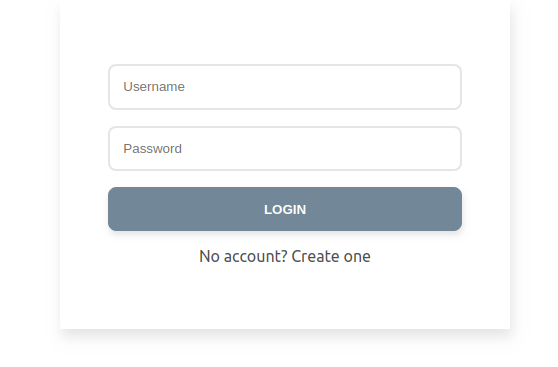
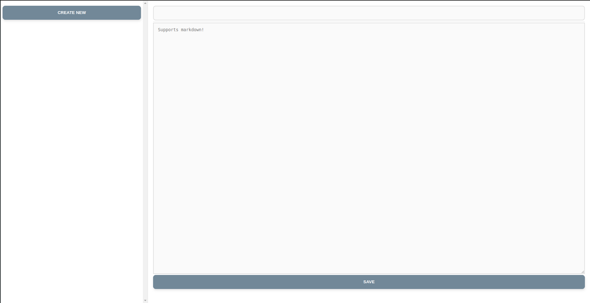
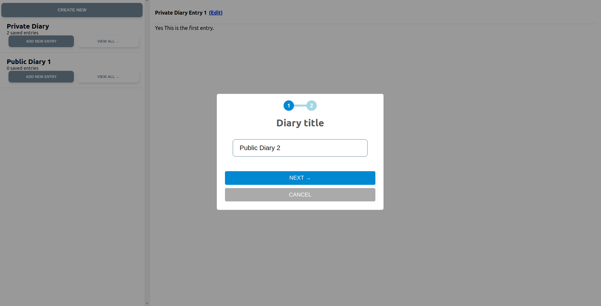
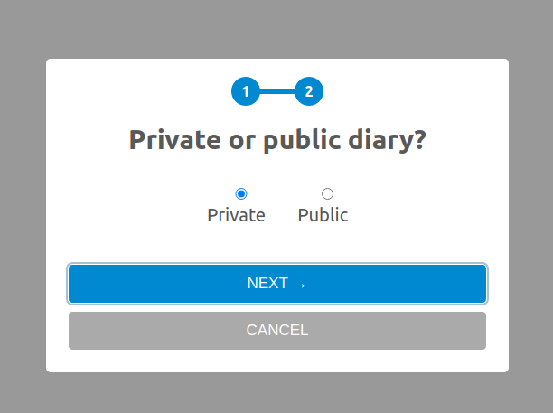

# Project 9B: Building Diaries App using React and Redux Toolkit with TypeScript.

**username**: test
**password**: password

There is no real backend server here. its being mocked by mirage even on netlify. Its pretty easy to setup a serverless faunadb backend with netlify functions. Might do that at some later point. 

## Observations:
Development with typescript feels like an absolute pain in the ass with schemas and keeping track of object types and interfaces. The typehints are good for the libraries that I use but so far typescript has felt like an unnecessary burden, But I can see its use, maybe with experience I'll see what I've been doing wrong that makes it feel like such a pain.

## Demo:
### Login:

### Main Diary:

### New Diary creation:

### Public or Private Diary?

